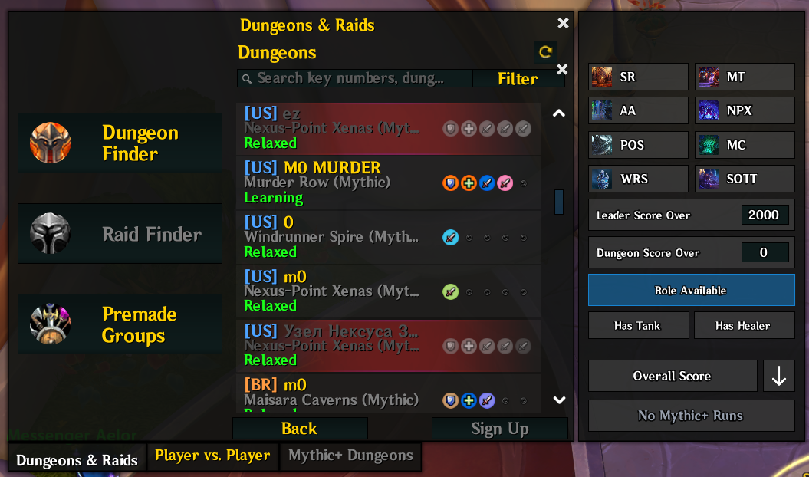

# RealmRegionTag

World of Warcraft Retail addon for the US region that adds a realm region tag to entries in the Premade Groups list.

## Features

- Splits US realms into `ET`, `CT`, `MT`, and `PT` based on realm timezone data.
- Keeps `OC`, `BR`, and `LA` tags for Oceanic, Brazil, and Latin America realms.
- Colors each tag for easier scanning.
- Defaults unknown realms to `US`.
- Supports a slash command toggle to switch US realm tags between unified `US` and split `USE` / `USC` / `USM` / `USP`.

## Commands

- `/rrt us` toggles US realms between unified `US` and split `USE`, `USC`, `USM`, and `USP`.
- `/rrt` prints the current mode and usage.

## Screenshot

## Install

Copy this folder into:

`World of Warcraft/_retail_/Interface/AddOns/RealmRegionTag`

Then reload the UI or restart the game.

## License

All Rights Reserved. See [LICENSE](LICENSE).
